# Deployment of a Microservice-based Application (Sockshop) on Kubernetes using modern approach

### Objective:
> Our aim is to deploy a microservices-based application, specifically the Socks Shop, using a modern approach that emphasizes automation and efficiency. The goal is to use Infrastructure as Code (IaaC) for rapid and reliable deployment on Kubernetes.

#### Project Overview
The Socks Shop application is a widely recognized microservices-based e-commerce platform, often utilized as a reference for showcasing modern cloud-native technologies. This application is composed of several microservices, each dedicated to a specific function such as product catalog, shopping cart, and user authentication. Designed with scalability, resilience, and fault tolerance in mind, the Socks Shop application is an ideal candidate for deployment on Kubernetes.

This project focuses on deploying the Socks Shop application on a Kubernetes cluster using an Infrastructure as Code (IaC) approach.

#### Prerequisites
To successfully complete this project, the following tools and services are required:

- Terraform : For provisioning infrastructure resources on Azure.
- Azure Account : To host the cloud infrastructure, including the Kubernetes cluster.
- Kubernetes : For container orchestration, managing the deployment and scaling of microservices.
- Helm : For managing Kubernetes applications as Helm charts.
Socks Shop Application : The microservices-based e-commerce platform being deployed.

>  For Infrastructure provisioning
Using Terraform, we will provision the necessary infrastructure resources on Azure. This approach ensures a clear and reproducible infrastructure setup.

### SETUP AND INITIALIZATION
 **STEP 1**

 The goal is to initialzile, plan and apply terraform in your working directory having configured all the necessary *.tf* files required for the provisioning the necessary resources and Kubernetes cluster on Azure. 

After creating and configuring the following terraform files *providers.tf, ssh.tf , main.tf, variables.tf, outputs.tf.* 

You run the following commands to initialize and set up Kubernertes cluster on Azure using terraform `terraform init --upgrade`,  

`terraform plan -out main.tf.plan`, 

`terraform apply main.tf.plan`

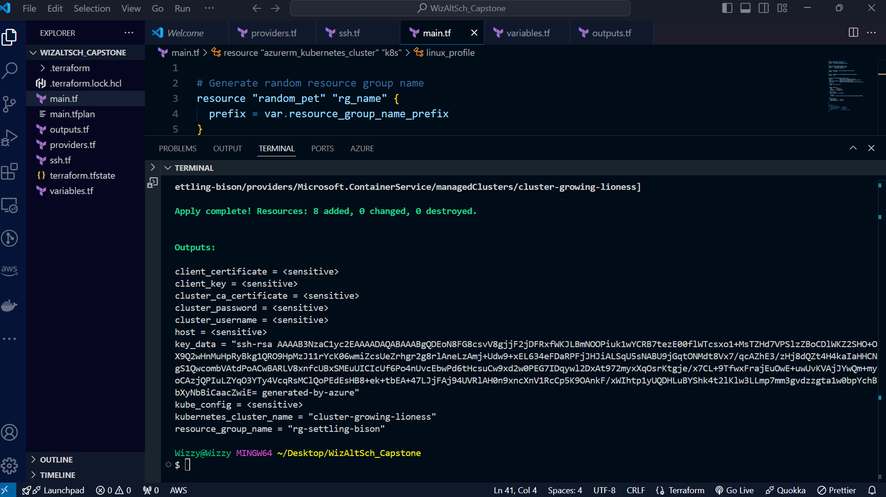

**STEP 2**

Once we've applied our terraform and all required resources have been added, we need to check that the health of the cluster with the command `kubectl get nodes` thereafter checking to confirm the active namespaces on thr cluster created using the command `kubectl getnamespace`.

We can also confirm from our Azure portal to check that the kubernetes service is up and running.

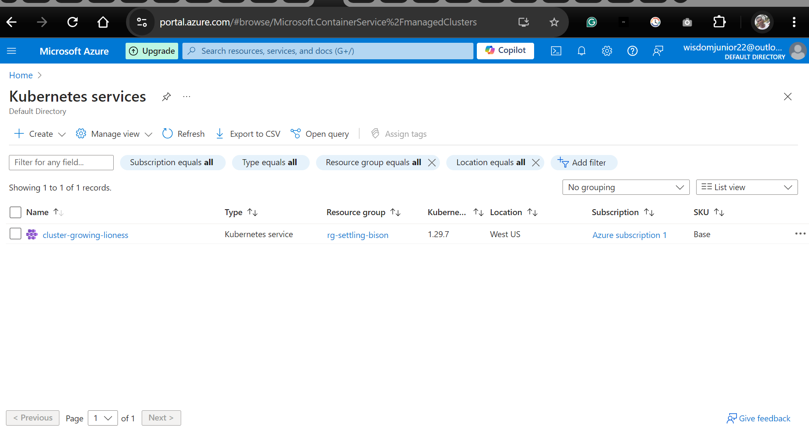

**STEP 3**

We were given this link *https://github.com/microservices-demo/microservices-demo/tree/master* to provision the sockshop microservice application and we'd use the yaml file to deploy.

After successfully deploying the application, we'd need to be sure the application is running smoothly by using the command `kubectl get pods,svc -sockshop.yaml`. This command simply lists all available pods and services in the specified namespace which in this case is sockshop.yaml.

**STEP 4**

Now it's important we install an ingress controller which helps to route traffic to our pods and is also useful for accessing our applicaton through an external ip. 

We'd use the command `helm search repo nginx` after adding th repo. 

After figuring out the exact name of the ingress to install, we use he command `helm install wizingress nginx/nginx-ingress`. The *wizingress* in the command is my personal name i decided to name the ingress.

Thereafter, simply check for successful installation of the service using `kubectl get pods,svc` and you should see the newly installed ingress controller alongsides other running pods and services.

You should also note that the ingess has an External I.P 40.78.82.178 which can be accessible through port 80 and would serve the frontend of our application.

We do not intend to view our application via i.p address as that's not a best practice so we'd be mapping this same external ip created by ingress to our designated domain name.

**STEP 5**

Using *htttps://namecheap.com* as our domain host, we update our domain name *(wisdomgoddy.me)* to point to the ip gotten from nginx-ingress so that our application can be accessible through the domain name we mapped the external ip.

**STEP 6**

In this step all we need to do is view our application that's mapped to the dommain name on our web browser.

**STEP 7**

We'd now deploy our monitoring and logging tools (Prometheus and Grafana) for our sockshop application. In order to successfuly do this, we'd use *helm* to add the repo with the command `helm repo add prometheus-community https://prometheus-community.github.io/helm-charts` to add the prometheus chart for our use.

Once the repo has been added successfuly, we'd then search the repo using the command `helm search repo prometheus` to search.

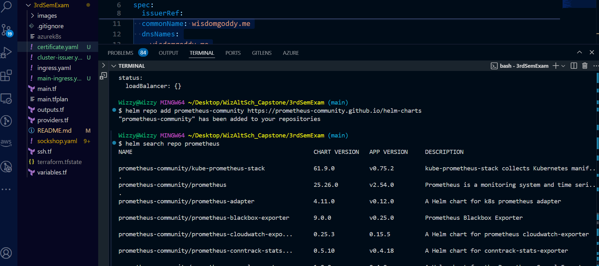

From the image above, we can see that a lot of charts are present in the repo we searched but we need just the one specific for prometheus and grafana. Using the command `helm install prome prometheus-community/kube-prometheus-stack -n sock-shop`

Our desired chart will be installed successfully.

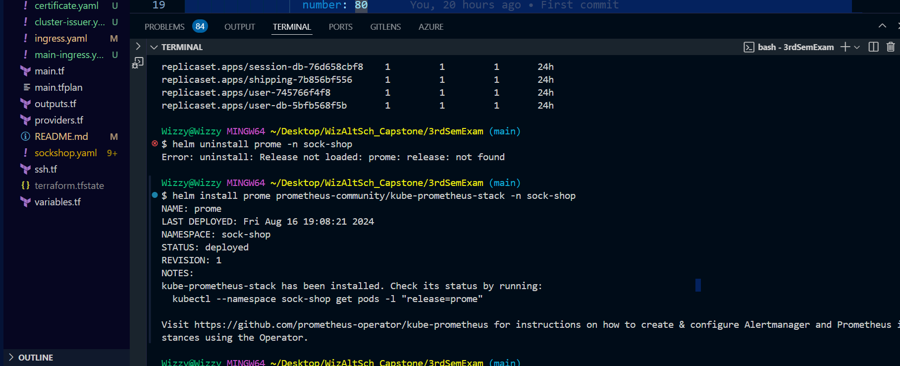

After installation, run the command `kubectl get pods,svc -n sock-shop` to view the pods and services in the sockshop namespace because the installation of prometheus chart was done in the namespace.

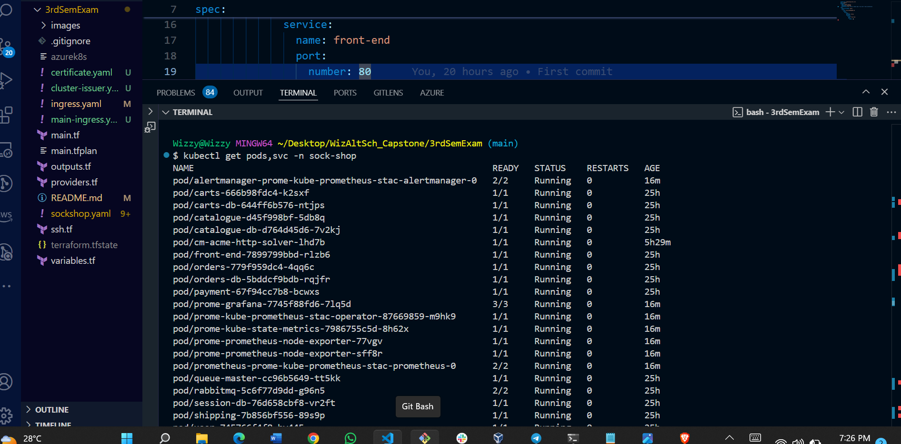

To view just the exact pods for our namespace `kubectl get pods -n sockshop`

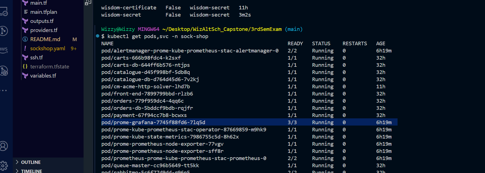

**STEP 8**

The next step is to get the default username and password for the grafana dashboard so we can monitor as an administrator.
To achieve this, we need to get the exact name of the grafana pods on our cluster as seen in the previous step then apply the command `kubectl describe pod <grafana pod name> -n sock-shop`.

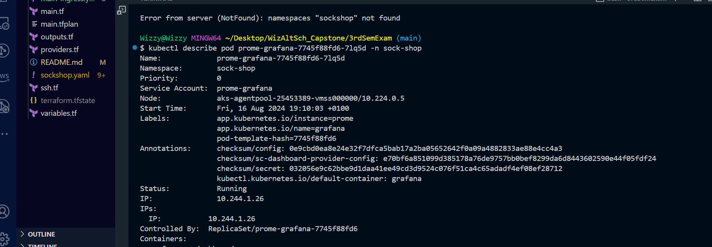

It describes the details of the pod and shows it is up and running. In the environment variable section we notice the grafana secret section as encrypted.

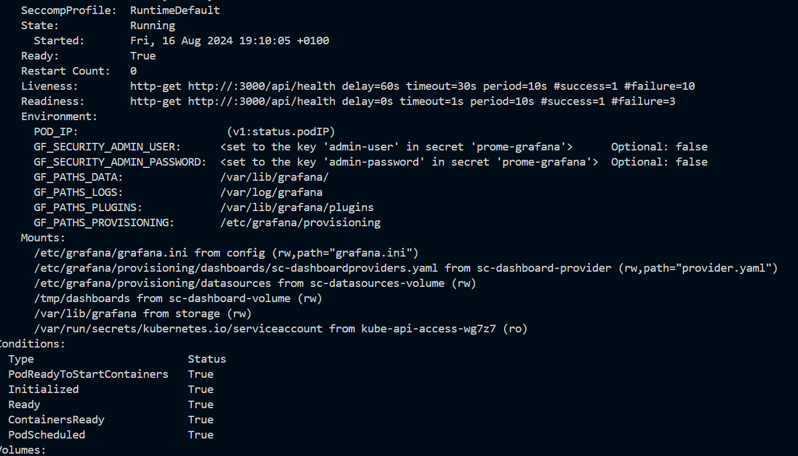

To decrypt the grafana admin user and admin password inorder to login to the grafana dashboard, run the following commands.  

`kubectl get secret prome-grafana -n <namespace> -o jsonpath="{.data.admin-user}" | base64 --decode`

`kubectl get secret prome-grafana -n <namespace> -o jsonpath="{.data.admin-password}" | base64 --decode`

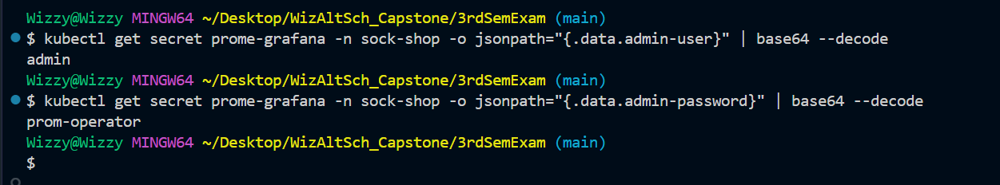

`kubectl get secret prome-grafana -n <namespace> -o jsonpath="{.data.admin-password}" | base64 --decode`

**STEP 9**

Before logging in to the grafana dashboard once login details has been retrived. We need to add the CName records on our namecheap DNS so we can access it via our web browser.

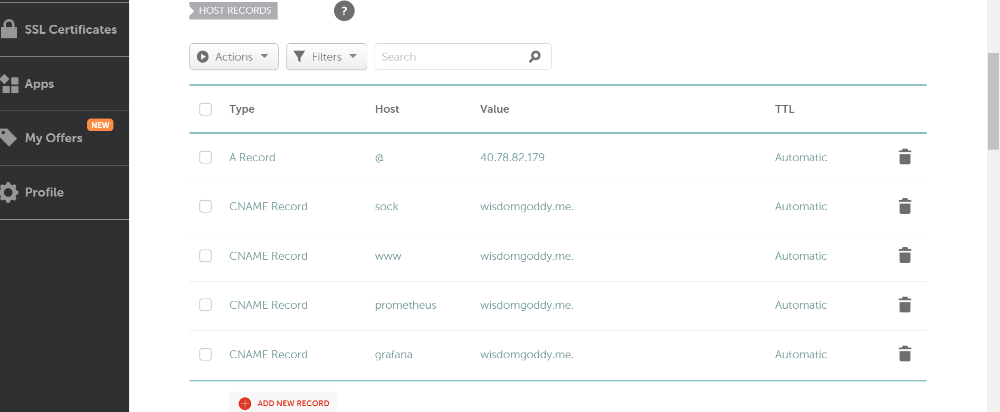

Once that's done we'd then move to access our grafana dashboard to monitor our deployed application.

Grafana login via *grafana.wisdomgoddy.me* domain name

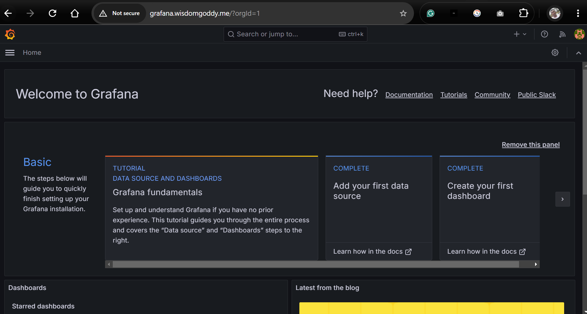

Grafana dashboard
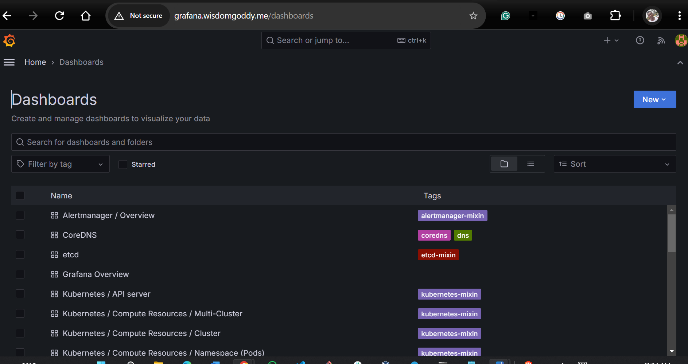

We'd do the same for prometheus. Accesing it via our web browser *prometheus.wisdomgoddy.me*

Prometheus login

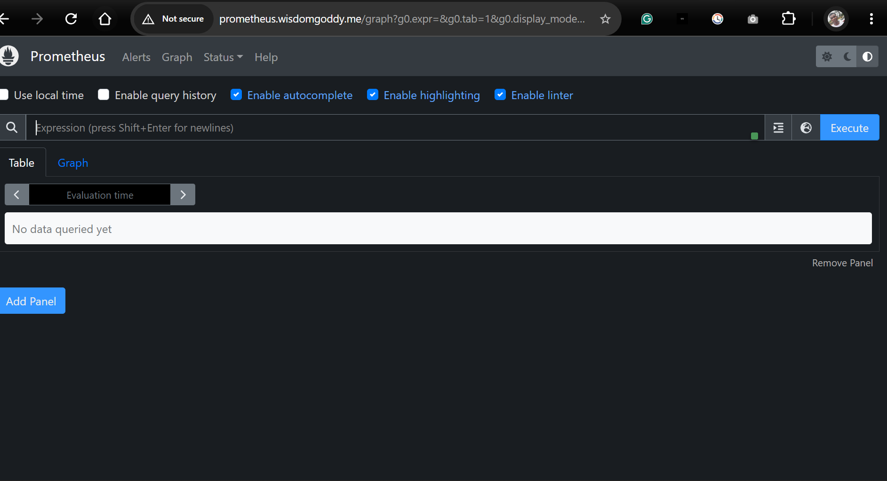

Prometheus targets

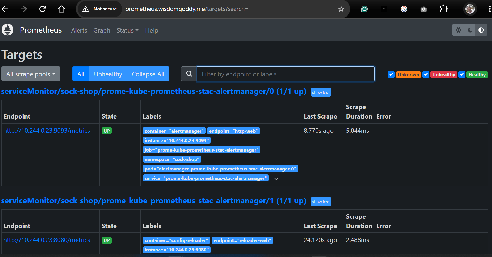

